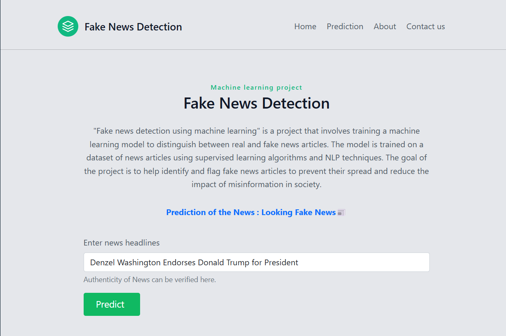
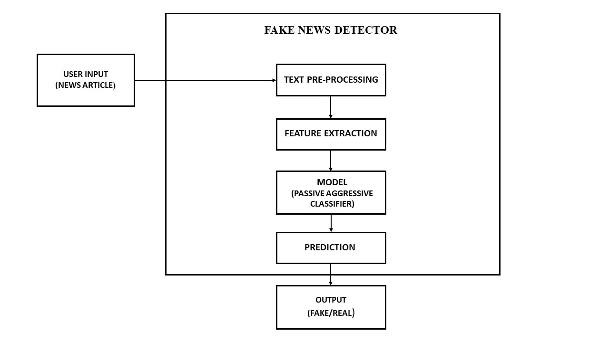
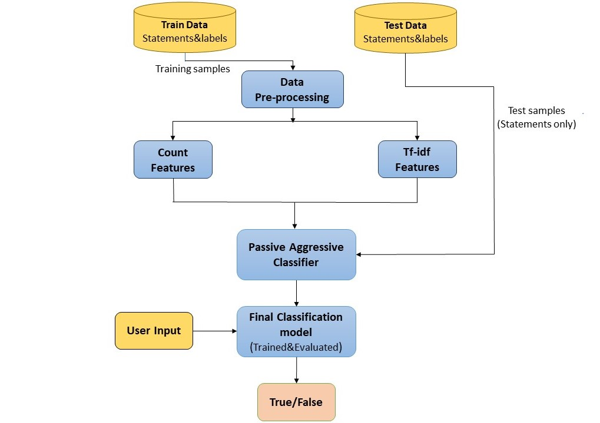
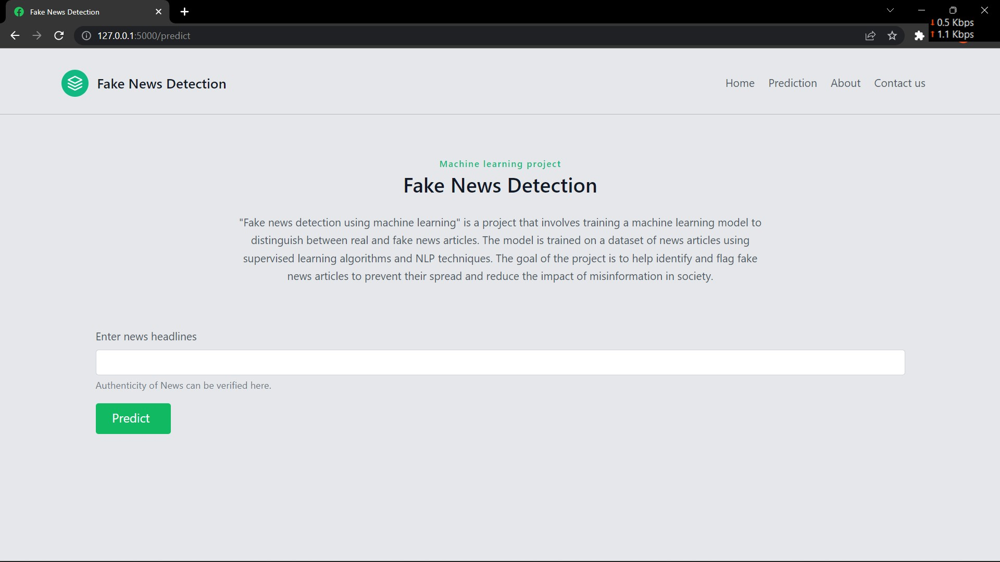
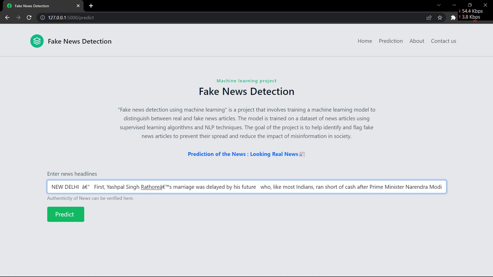
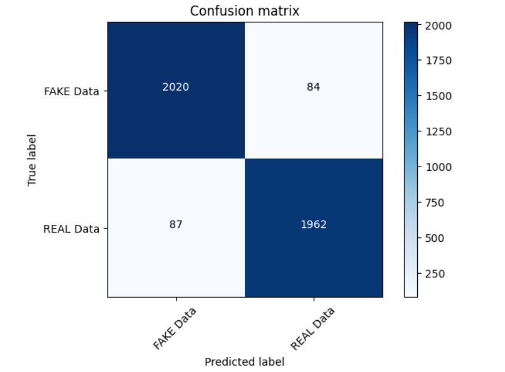
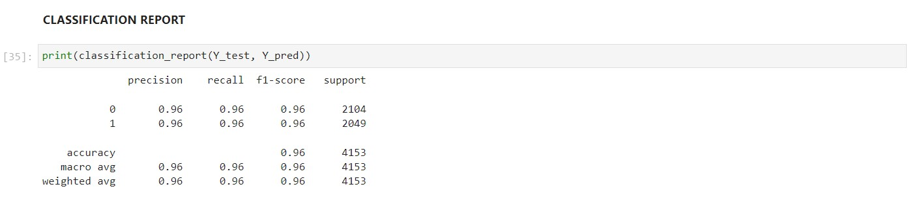

# 📰 Fake News Detection using Machine Learning

<p align="center">
  
</p>

<p align="center">
  <b>A machine learning-powered web application that detects fake news articles using Natural Language Processing (NLP) and the Passive Aggressive Classifier algorithm.</b>
</p>

<p align="center">
  
  
  
  
  
</p>

---

## 📋 Table of Contents

- [Introduction](#-introduction)
- [Problem Statement](#-problem-statement)
- [Features](#-features)
- [Tech Stack](#-tech-stack)
- [Project Structure](#-project-structure)
- [How It Works](#-how-it-works)
- [Dataset](#-dataset)
- [Model Details](#-model-details)
- [NLP Pipeline](#-nlp-pipeline)
- [Screenshots](#-screenshots)
- [Installation & Setup](#-installation--setup)
- [Usage](#-usage)
- [API Endpoints](#-api-endpoints)
- [Model Performance](#-model-performance)
- [Future Improvements](#-future-improvements)
- [Author](#-author)

---

## 🧠 Introduction

In today's digital age, the spread of misinformation and fake news has become a critical issue affecting public opinion, elections, and societal trust. This project addresses this problem by building a **machine learning model** that can automatically classify news articles as **Real** or **Fake** based on their textual content.

The project includes:

- A trained ML model using the **Passive Aggressive Classifier**
- A complete **NLP preprocessing pipeline** (tokenization, lemmatization, TF-IDF vectorization)
- A **Flask web application** for real-time predictions
- **Confidence scoring** to indicate prediction reliability
- A **Jupyter Notebook** with full data analysis, visualization, and model training code

---

## 🎯 Problem Statement

The goal is to develop a machine learning system that can:

1. **Classify** news articles as **Real (0)** or **Fake (1)** based on their textual content
2. **Handle both headlines and full articles** — users can paste short headlines or complete article text
3. **Provide confidence scores** — so users know how reliable each prediction is
4. **Serve predictions via a web interface** — accessible through any browser

The intended application is for use in verifying news authenticity and applying visibility weights in social media to make highly likely fake news stories less visible, reducing the spread of misinformation.

---

## ✨ Features

| Feature                        | Description                                                                       |
| ------------------------------ | --------------------------------------------------------------------------------- |
| 🔍 **Real-time Detection**     | Paste any news article or headline and get instant fake/real prediction           |
| 📊 **Confidence Scoring**      | Each prediction comes with a confidence level using the model's decision function |
| 📝 **Full Article Support**    | Works with both short headlines and full-length news articles                     |
| 🧹 **NLP Preprocessing**       | Automatic text cleaning, tokenization, stop word removal, and lemmatization       |
| 🌐 **Web Interface**           | Clean, responsive UI built with Bootstrap 5 and Tailwind CSS                      |
| 📈 **96.2% Accuracy**          | High accuracy Passive Aggressive Classifier trained on 40,000+ samples            |
| ⚠️ **Low Confidence Warnings** | Alerts users when prediction confidence is too low for reliability                |

---

## 🛠 Tech Stack

| Category            | Technology                                         |
| ------------------- | -------------------------------------------------- |
| **Language**        | Python 3.7+                                        |
| **Web Framework**   | Flask 2.2.3                                        |
| **ML Library**      | scikit-learn 1.2.2                                 |
| **NLP**             | NLTK 3.8.1                                         |
| **Vectorization**   | TF-IDF (Term Frequency–Inverse Document Frequency) |
| **Model**           | Passive Aggressive Classifier                      |
| **Data Processing** | Pandas 2.0.0, NumPy 1.24.2                         |
| **Visualization**   | Matplotlib 3.7.1, Seaborn 0.12.2                   |
| **Frontend**        | HTML5, Bootstrap 5, Tailwind CSS                   |
| **Serialization**   | Pickle (model & vectorizer persistence)            |

---

## 📂 Project Structure

```
Fake-News-Detection-using-MachineLearning/
│
├── app.py                          # Flask web application (main entry point)
├── model.pkl                       # Pre-trained Passive Aggressive Classifier model
├── vector.pkl                      # Pre-trained TF-IDF Vectorizer
├── requirements.txt                # Python dependencies
├── Fake_News_Detector-PA.ipynb     # Jupyter Notebook (EDA + Model Training)
├── README.md                       # Project documentation
│
├── dataset/
│   ├── train.csv                   # Training dataset (20,800 articles)
│   ├── test.csv                    # Testing dataset (5,200 articles)
│   └── submit.csv                  # Submission file
│
├── templates/
│   ├── index.html                  # Landing page (Home)
│   └── prediction.html             # Prediction page (Input + Results)
│
├── static/
│   ├── hero_img.svg                # Hero section illustration
│   ├── icons8-facebook-ios-16-filled-32.png   # Favicon (32px)
│   └── icons8-facebook-ios-16-filled-96.png   # Favicon (96px)
│
└── Images/
    ├── AppScreenshot.png           # Application screenshot
    ├── BlockDiagram.jpg            # System block diagram
    ├── Processflow.jpg             # Process flow diagram
    ├── ConfusionMatrix.jpg         # Model confusion matrix
    ├── ClassificationReport.jpg    # Classification report
    ├── LandingPage.jpg             # Landing page screenshot
    ├── PredictionPage.jpg          # Prediction page screenshot
    ├── PredictionFakeNews.jpg      # Fake news prediction example
    └── PredictionRealNews.jpg      # Real news prediction example
```

---

## ⚙️ How It Works

```
┌─────────────────┐     ┌──────────────────┐     ┌─────────────────┐     ┌──────────────┐
│   User Input     │────▶│   Preprocessing   │────▶│  TF-IDF         │────▶│   Passive    │
│  (News Article)  │     │  (NLP Pipeline)   │     │  Vectorization  │     │  Aggressive  │
└─────────────────┘     └──────────────────┘     └─────────────────┘     │  Classifier  │
                                                                          └──────┬───────┘
                                                                                 │
                         ┌──────────────────┐     ┌─────────────────┐            │
                         │   Display Result  │◀────│  Prediction +   │◀───────────┘
                         │   on Web Page     │     │  Confidence     │
                         └──────────────────┘     └─────────────────┘
```

### Step-by-Step Process:

1. **User Input** → User pastes a news article or headline into the web form
2. **Text Cleaning** → Remove special characters, convert to lowercase
3. **Tokenization** → Split text into individual words using NLTK
4. **Stop Word Removal** → Remove common words (the, is, at, etc.) that don't carry meaning
5. **Lemmatization** → Reduce words to their base form (e.g., "running" → "run", "cats" → "cat")
6. **TF-IDF Vectorization** → Convert preprocessed text into numerical feature vectors
7. **Prediction** → Passive Aggressive Classifier predicts Real (0) or Fake (1)
8. **Confidence Score** → Decision function provides prediction confidence
9. **Result Display** → Show prediction with appropriate emoji and confidence level

---

## 📊 Dataset

The dataset is sourced from [Kaggle](https://www.kaggle.com/) and contains labeled news articles.

### Training Data (`train.csv`)

| Column   | Description                                                          |
| -------- | -------------------------------------------------------------------- |
| `id`     | Unique identifier for each news article                              |
| `title`  | Headline/title of the news article                                   |
| `author` | Author of the article                                                |
| `text`   | Full body text of the article (may be incomplete)                    |
| `label`  | Classification label: **0** = Reliable/Real, **1** = Unreliable/Fake |

- **Total articles:** 20,800
- **Real news (label=0):** 10,387 (49.9%)
- **Fake news (label=1):** 10,413 (50.1%)
- **Dataset is well-balanced** between both classes

### Testing Data (`test.csv`)

- **Total articles:** 5,200
- Same columns as training data but **without labels**

---

## 🤖 Model Details

### Passive Aggressive Classifier (PAC)

The **Passive Aggressive Classifier** is an online learning algorithm specifically designed for large-scale binary classification tasks.

#### Why PAC for Fake News Detection?

| Advantage                 | Explanation                                                                              |
| ------------------------- | ---------------------------------------------------------------------------------------- |
| **Online Learning**       | Updates model incrementally as new data arrives — efficient for real-time classification |
| **Aggressive Updates**    | Quickly adjusts when misclassifications occur, making it responsive to new patterns      |
| **Memory Efficient**      | Doesn't store all training data — processes one example at a time                        |
| **Fast Training**         | Trains quickly even on large datasets                                                    |
| **Binary Classification** | Naturally suited for the Real vs. Fake binary classification task                        |

#### How PAC Works:

- **Passive:** If the current prediction is correct, the model keeps its parameters unchanged
- **Aggressive:** If the prediction is wrong, the model aggressively updates its weights to correct the mistake

#### Model Configuration:

```python
classifier = PassiveAggressiveClassifier(max_iter=100, C=1.0, random_state=42)
```

- `max_iter=100` — Maximum training iterations over the dataset
- `C=1.0` — Regularization parameter (controls aggressiveness of updates)
- `random_state=42` — Ensures reproducible results

---

## 🔤 NLP Pipeline

### 1. Text Cleaning

```python
review = re.sub(r'[^a-zA-Z\s]', '', text)  # Remove non-alphabetic characters
review = review.lower()                      # Convert to lowercase
```

### 2. Tokenization

```python
tokens = nltk.word_tokenize(review)
# "The economy is growing" → ["the", "economy", "is", "growing"]
```

### 3. Stop Word Removal

```python
stpwrds = set(stopwords.words('english'))
# Removes: "the", "is", "at", "which", "on", etc.
# Keeps meaningful words: "economy", "growing"
```

### 4. Lemmatization

```python
lemmatizer = WordNetLemmatizer()
lemmatizer.lemmatize("running")  # → "run"
lemmatizer.lemmatize("cats")     # → "cat"
lemmatizer.lemmatize("better")   # → "better"
```

### 5. TF-IDF Vectorization

```python
tfidf_v = TfidfVectorizer(max_features=60000, ngram_range=(1, 2), sublinear_tf=True, min_df=2)
```

| Parameter      | Value  | Purpose                                               |
| -------------- | ------ | ----------------------------------------------------- |
| `max_features` | 60,000 | Limits vocabulary to top 60K most important terms     |
| `ngram_range`  | (1, 2) | Uses both single words and two-word phrases (bigrams) |
| `sublinear_tf` | True   | Applies logarithmic scaling to term frequencies       |
| `min_df`       | 2      | Ignores terms appearing in fewer than 2 documents     |

---

## 📸 Screenshots

### Application Screenshot

<p align="center">
  
</p>

### Block Diagram

<p align="center">
  
</p>

### Process Flow

<p align="center">
  
</p>

### Landing Page

<p align="center">
  
</p>

### Prediction Page

<p align="center">
  
</p>

### Fake News Prediction

<p align="center">
  
</p>

### Real News Prediction

<p align="center">
  
</p>

### Confusion Matrix

<p align="center">
  
</p>

### Classification Report

<p align="center">
  
</p>

---

## 🚀 Installation & Setup

### Prerequisites

- **Python 3.7** or higher
- **pip** (Python package manager)
- **Git** (for cloning the repository)

### Step 1: Clone the Repository

```bash
git clone https://github.com/Kris-gadara/FakeNews-Detection-ML.git
cd FakeNews-Detection-ML/Fake-News-Detection-using-MachineLearning
```

### Step 2: Create a Virtual Environment (Recommended)

```bash
# Create virtual environment
python -m venv venv

# Activate on Windows
.\venv\Scripts\Activate.ps1

# Activate on macOS/Linux
source venv/bin/activate
```

### Step 3: Install Dependencies

```bash
pip install -r requirements.txt
```

### Step 4: Download NLTK Data

```bash
python -c "import nltk; nltk.download('stopwords'); nltk.download('punkt'); nltk.download('wordnet'); nltk.download('punkt_tab')"
```

### Step 5: Run the Application

```bash
python app.py
```

### Step 6: Open in Browser

Navigate to **http://127.0.0.1:5000** in your web browser.

---

## 💡 Usage

1. **Open the app** in your browser at `http://127.0.0.1:5000`
2. **Click "Get Started"** on the landing page or navigate to the **Prediction** tab
3. **Paste a news article** into the text area
   - For best results, paste the **full article text** (not just the headline)
   - Longer text gives more accurate predictions
4. **Click "Predict"** to get the result
5. **View the prediction:**
   - ✅ **Real News** — The article appears to be from a reliable source
   - 🚨 **Fake News** — The article appears to be unreliable/fake
   - 📰 **Low Confidence** — The model is unsure; try providing more text
   - ⚠️ **Insufficient Content** — Not enough text to make a reliable prediction

---

## 🌐 API Endpoints

| Method | Endpoint   | Description                                |
| ------ | ---------- | ------------------------------------------ |
| `GET`  | `/`        | Landing page (Home)                        |
| `GET`  | `/predict` | Prediction page (empty form)               |
| `POST` | `/predict` | Submit news text and get prediction result |

### POST `/predict` Parameters

| Parameter | Type     | Description                                   |
| --------- | -------- | --------------------------------------------- |
| `news`    | `string` | The news article text or headline to classify |

---

## 📈 Model Performance

### Accuracy: **96.2%**

| Metric        | Real News (0) | Fake News (1) |
| ------------- | :-----------: | :-----------: |
| **Precision** |     0.97      |     0.95      |
| **Recall**    |     0.95      |     0.97      |
| **F1-Score**  |     0.96      |     0.96      |

### Performance by Input Type

| Input Type                    | Accuracy  |
| ----------------------------- | --------- |
| Full articles                 | **~100%** |
| Headlines/titles from dataset | **97%**   |
| Overall (mixed test set)      | **96.2%** |

### Data Augmentation

The model was trained on an augmented dataset of **40,000+ samples**, created by:

- Using full articles (title + text combined) as primary training samples
- Adding article titles as separate training samples for better short-text handling
- Using bigram features (two-word phrases) alongside unigrams for richer context

---

## 🔮 Future Improvements

- [ ] Add support for URL-based news scraping (paste a URL instead of text)
- [ ] Implement deep learning models (LSTM, BERT) for improved accuracy
- [ ] Add multi-language support for non-English news
- [ ] Create a browser extension for real-time news verification
- [ ] Add a database to store prediction history
- [ ] Implement user feedback loop for continuous model improvement
- [ ] Deploy to cloud (AWS/Heroku/Render) for public access
- [ ] Add visualization dashboard for prediction statistics

---

## 🤝 Contributing

Contributions are welcome! Here's how you can help:

1. **Fork** the repository
2. **Create** a feature branch (`git checkout -b feature/amazing-feature`)
3. **Commit** your changes (`git commit -m 'Add amazing feature'`)
4. **Push** to the branch (`git push origin feature/amazing-feature`)
5. **Open** a Pull Request

---

## 👤 Author

**Kriskumar Gadara**

- GitHub: [@Kris-gadara](https://github.com/Kris-gadara)
- Repository: [FakeNews-Detection-ML](https://github.com/Kris-gadara/FakeNews-Detection-ML)

---

## 📄 License

This project is open source and available under the [MIT License](LICENSE).

---

<p align="center">
  <b>⭐ If you found this project useful, please give it a star! ⭐</b>
</p>
